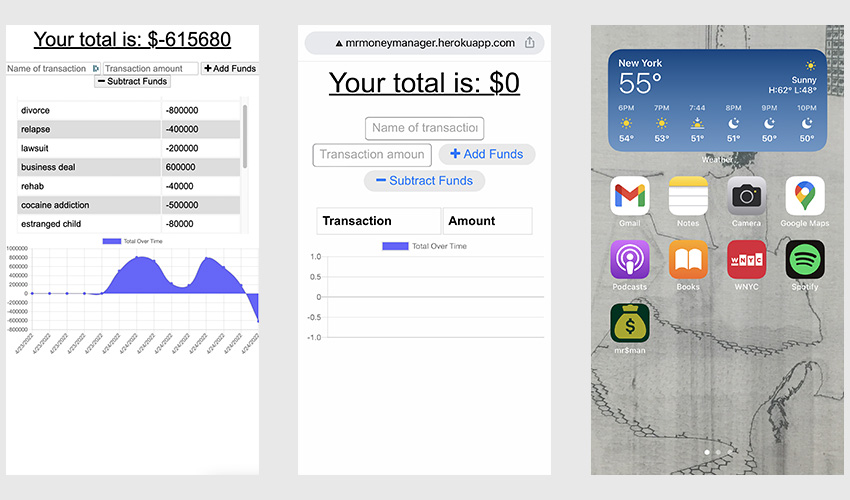

# mr$manager 1.0
  

  

  [deployed app website](https://mrmoneymanager.herokuapp.com/)
  ## OVERVIEW:
   An income and expense tracking progressive web app. This is useful for keeping track of and visualizing your income and spending habits. In being functional both online and off, and syncing when connectivity is available, this app allows the user to have a firm idea of the money in their account whether or not they have an internet connection. By visualizing the nature of income and expenditures, the user should be able to understand their own habits to make better financial decisions going forward.

  ## Table Of Contents:
  [Installation](README.md#installation) 
  [Usage](README.md#usage) 
  [Tests](README.md#tests) 
  [Credits](README.md#credits) 
  [Questions](README.md#questions) 
  [License](README.md#license) 

  ## Installation
  The app is available as a functional website at https://mrmoneymanager.herokuapp.com/ - if the user would like to install it on their phone or desktop it is available to download as an app for no cost at that site.

  ## Usage
  Users can enter income and expenses as they occur and the app will keep track of the ebb and flow in real time, online or off. When the device detects an internet connection it will sync up with the Mongo DB database.

  ## Tests
  Development of this app was tested with Insomnia.

  ## Credits
  The app uses MongoDB Atlas as an external server and client side DB when offline. It is hosted on Heroku and also uses compression, express, mongoose, and morgan, and all relevant dependencies. Many thanks to the developer community who made this app possible.

  ## Questions
  [Becket, Codeclast](becketbowes@gmail.com)
  [Github Page](http://www.github.com/becketbowes)

  ## License
  [Creative Commons Attribution License, Sun Apr 24 2022 17:46:09 GMT-0400 (Eastern Daylight Time)](https://creativecommons.org/licenses/by/4.0/legalcode)
